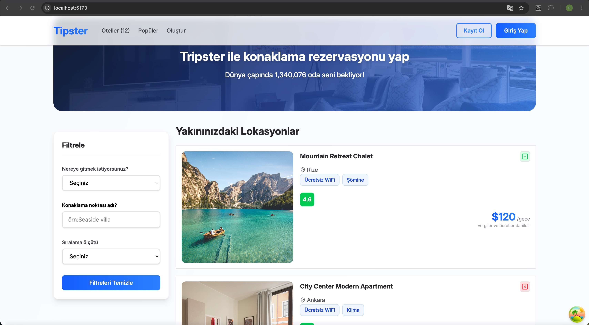

# Hotels

Performans, tip güvenliği ve sorunsuz kullanıcı deneyimi için tasarlanmış modern bir full-stack konaklama yönetimi ve keşif platformu.

## Proje Özeti

Hotels, konaklama listelerinin keşfedilmesi, yönetilmesi ve denetlenmesini kolaylaştırmak için tasarlanmış kapsamlı bir uygulamadır. Platform, kullanıcıların gelişmiş filtreleme yetenekleriyle mevcut yerleşimleri göz atmasını, belirli konaklama yerleri hakkında ayrıntılı bilgileri görüntülemesini ve listeleme yönetimi için idari işlevsellik sağlar. Mimari, güçlü istemci-taraf durum yönetimi, verimli veri getirme ve tüm yığında tür açısından güvenli geliştirme uygulamalarını vurgular.

## Teknik Mimari

### Frontend Stack

Frontend, **React 19** ve **TypeScript 5.8** temelinde inşa edilmiştir ve derleme zamanında tip güvenliği ile geliştirilmiş geliştirici deneyimi sağlar. Uygulama, **Vite** yapı aracını kullanarak optimize edilmiş geliştirme ve üretim derlemeleri sunmaktadır.

**Durum Yönetimi ve Veri Getirme:**

- **TanStack React Query** (v5.100.9) — Yerleşik önbelleğe alma, otomatik yeniden getirme ve arka plan senkronizasyon stratejileriyle sunucu durumu senkronizasyonunu yönetir
- **TanStack React Query DevTools** — Geliştirme sırasında sorgu ve mutasyon durumlarının gerçek zamanlı denetimini sağlar

**Yönlendirme ve Navigasyon:**

- **React Router DOM** (v7.14.2) — İç içe rota desteği ve dinamik sayfa geçişleriyle istemci-taraf yönlendirmesi

**Form Yönetimi ve Doğrulama:**

- **Formik** (v2.4.9) — Basitleştirilmiş form durum yönetimi
- **Yup** (v1.7.1) — Kapsamlı tip çıkarımı ile şema tabanlı doğrulama

**UI ve Stil:**

- **Tailwind CSS 4.2** — Minimal çalışma zamanı ek yüküyle yardımcı-birinci CSS çerçevesi
- **Lucide React** — Hafif, erişilebilir ikon kütüphanesi

**HTTP İletişimi:**

- **Axios** (v1.16.0) — İstek/yanıt müdahaleleriyle Promise tabanlı HTTP istemcisi

**Kullanıcı Geri Bildirimi:**

- **React Toastify** — Kullanıcı etkileşimleri için müdahale etmeyen toast bildirimleri

### Backend Stack

Backend, **Node.js** ve **Express.js** ile inşa edilmiştir ve hafif ve verimli bir REST API katmanı sağlar. Mimari, modüler denetleyici ve rota organizasyonu aracılığıyla kaygıların ayrılmasını uygular ve çapraz kökenli istekler için CORS desteği sunar.

## Tasarım Desenleri ve Kuralları

- **Tür Açısından Güvenli Geliştirme**: Tüm frontend kod tabanında kapsamlı TypeScript uygulaması, derleme zamanında tip güvenliğini sağlar ve çalışma zamanı hatalarını önler
- **Bileşen Mimarisi**: Sunulan ve konteyner bileşenleri arasında net ayrım olan modüler React bileşen yapısı
- **Özel Kancalar**: İş mantığı ve veri getirme desenleri içermek için yeniden kullanılabilir React kancaları
- **API Soyutlama**: HTTP endişelerini bileşen mantığından ayıran merkezi API hizmet katmanı
- **Form Doğrulaması**: Platform genelinde tutarlı veri bütünlüğünü sağlayan şema tabanlı doğrulama

## Temel Özellikler

- **Yer Keşfi**: Konum tabanlı ve fiyat tabanlı filtrelemeyle konaklama listelerini göz atın ve filtreleyin
- **Ayrıntılı Bilgiler**: Resimler, olanaklar, derecelendirmeler ve uygunluk durumuna sahip kapsamlı yer detay sayfaları
- **İdari Arayüz**: Bir yönetici formu aracılığıyla yeni konaklama listelerini oluşturun ve yönetin
- **Duyarlı Tasarım**: Tailwind CSS yardımcı sınıfları ile oluşturulmuş mobil-birinci duyarlı arayüz
- **Gerçek Zamanlı Geri Bildirim**: Başarılı işlemler ve hata işleme için kullanıcı bildirimleri

## Performans Hususları

Uygulama, şu yollarla performansa öncelik verir:

- TanStack React Query'nin akıllı önbelleğe alma mekanizmalarıyla sunucu durumu yönetimi
- Vite'nin hızlı yapı sistemi ve ES modülü tabanlı geliştirme
- Çalışma zamanı hatalarını ve hata ayıklama ek yükünü azaltan tür açısından güvenli kod
- Ağaç sallama ve kod bölümleme aracılığıyla optimize edilmiş paket boyutu

## Ekran Görüntüsü

## Gıf

